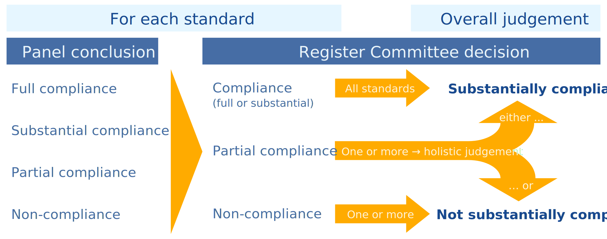

# 1. Introduction

The Standards and Guidelines for Quality Assurance in the European Higher Education Area (ESG, 2015) provide the European framework against which the quality assurance agencies (QAAs) and their activities are assessed.

The European Quality Assurance Register for Higher Education (EQAR) manages the register of quality assurance agencies that have demonstrated their substantial compliance with the ESG[^esg]. The Register Committee[^rc] is EQAR's independent decision-making body that decides on inclusion of quality assurance agencies on the Register.

EQAR manages and publishes the Database of External Quality Assurance Results (DEQAR). Registered agencies may participate in DEQAR and feed their quality assurance reports and decisions into the database.

Registration on EQAR stands as a quality label for agencies and has developed significant recognition and trust within the EHEA and beyond. In effect, EQAR makes a public statement – and thus seeks to ensure – that higher education accredited, audited, reviewed or evaluated by registered QA agencies is fit for purpose and aligned with ESG Part 1. By doing so, EQAR seeks to serve as a basis for trust and automatic recognition.

This public statement is built on trust in the registered agencies' commitment to continuously ensure compliance with the ESG in their work. Compliance with the ESG is demonstrated through an external review[^review] of the applicant/registered agency.

Reviews against the ESG for the purpose of EQAR registration are coordinated by an organisation, chosen by the applicant/registered agency, that has the necessary professional capacity and is independent of the agency under review, and carried out by an independent panel, appointed by the coordinator. The coordinator and the panel thus carry an important responsibility and significant trust is put into their work.

# 2. Aims and Status of this Policy

The criterion for registration is substantial compliance with the ESG, which were adopted by European ministers of higher education. The standards themselves are thus authoritative and the binding reference point for both agencies and review panels.

Virtually every set of standards, however, leaves room for interpretation in real life and its use for compliance decisions will inevitably set precedents. The present policy provides explanations that serve to assist agencies, review panels and the Register Committee itself when interpreting the standards. They support a common understanding, but are not exhaustive or exclusive.

These explanations are based on the Register Committee's past decisions and precedents that have incrementally been set. They relate to the use of the ESG for the European register of agencies exclusively, and are not pertinent to other uses of the ESG.

The present policy on the Use and Interpretation of the ESG thus aims to:

* set out how the EQAR Register Committee uses external review reports and makes a decision on their basis;
* indicate which information the EQAR Register Committee requires to make well-informed, fair and consistent decisions;
* ensure clarity as to which activities are within the scope of the ESG and, thus, covered by the label “registration on EQAR”[^trademark] and
* facilitate the consistency and transparency of the Register Committee's decisions[^decisions].

While key parts of the introduction to the ESG as well as the standards of Parts 2 and 3 are quoted in this document, it should always be read in conjunction with the full text of the ESG. In case of doubt or contradictions, the text of the ESG themselves always has priority.

# 3. Key Concepts and Definitions

The Register Committee uses the following key concepts and definitions, which are based on those defined by the ESG:

* The **standards** are minimum requirements that have to be adhered to, based on agreed and accepted practice for quality assurance in higher education.
* The **guidelines** provide explanation in relation to the importance or the possible implementation of the standard. While the guidelines thus support the Register Committee in interpreting the standards when needed, the guidelines themselves are not requirements.
* The term **programme** refers to higher education provision in its broadest sense, including provision that is not part of a programme leading to a formal degree.

  That is, the ESG equally apply, mutatis mutandis, to education provision at higher education levels[^eqf] outside of traditional standalone degree programmes (e.g. micro-credentials, alternative credentials, continuing education, etc.).

  Moreover, the ESG specify that they apply to all higher education "regardless of the mode of study or place of delivery". Hence, they equally apply to online and blended learning.
* Unless otherwise specified, **stakeholders** are understood to cover all actors within an institution, including students and staff, as well as external stakeholders such as employers and external partners of an institution.
* The term **institution** refers to higher education institutions. Depending on how responsibilities for quality assurance are assigned within the institution it can, however, also refer to subdivisions such as faculties or departments.
* The term **quality assurance activity** refers to a distinct type of external evaluation, accreditation, audit or review deployed by an agency, based on a separate set of processes and criteria. For instance, “programme accreditation” might be one activity and “institutional evaluation” another one. The activities may range from purely enhancement-driven ones to formal assessment and decisions.

# 4. Scope and Applicability of the ESG

EQAR registration does not only lend credibility to an agency generally, but also to its individual reports and thereby to the higher education institutions and programmes quality-assured by the agency; this has become even more visible since the launch of DEQAR.

The scope of an agency's registration determines which reports an agency may upload to DEQAR and, consequently, which institutions/programmes will feature in DEQAR. It is therefore crucial to clearly delineate the scope of an agency's registration, ensuring that:

1. Only quality assurance activities that are by their nature external quality assurance as described by the ESG are considered in scope; and
2. Those activities do comply with the ESG.

At the same time, registration on EQAR is usually perceived as a label awarded to the entire agency. In the interest of protecting the EQAR label and utmost clarity for the public, the Register Committee therefore expects that all those activities that are by their nature/characteristics within the scope of the ESG are conducted in compliance with the ESG. In turn, the Register Committee seeks to prevent that EQAR's name and standing are brought in connection with activities that are outside the scope of the ESG and, thus, outside its purview.

Where agencies have subsidiaries that are not effectively distinguishable from the agency itself, the activities, or parts of activities, carried out by those subsidiaries are expected to be in substantial compliance with the ESG as well (see Annex 2 for details).

## 4.1 Activities within the Scope of the ESG

> The focus of the ESG is on quality assurance related to learning and teaching in higher education, including the learning environment and relevant links to research and innovation. [...]
>
> The ESG apply to all higher education offered in the EHEA regardless of the mode of study or place of delivery. Thus, the ESG are also applicable to all higher education including transnational and cross-border provision. In this document the term “programme” refers to higher education in its broadest sense, including that which is not part of a programme leading to a formal degree. [...]
>
> At the heart of quality assurance activities are the twin purposes of accountability and enhancement. Taken together, these create trust in the higher education institution’s performance.[^esg-scope]

The ESG generally relate to processes following an expert or peer review methodology, addressing the quality dimensions described in Part 1 of the ESG, resulting in an official report and frequently also in a formal decision or judgement. In particular, “ESG-type activities” are characterised by the following:

* **(a) Subject**: the activity is substantially concerned with teaching and learning in higher education (see definition of "programme" above), including the learning environment and relevant links to research and innovation.
* **(b) Object**: the activity concerns (an) organisational unit(s) such as (an) individual higher education institution(s), (a) study programme(s), (a) faculty(ies) or (a) department(s).[^staff-evaluations]
* **(c) Nature**: the activity follows a predefined process in which the object is evaluated/assessed against a set of predefined standards or another reference point, with limited or no flexibility[^third-party-processes]; or the activity is undertaken for the purpose of awarding any kind of certificate, label or mark.
* **(d) Typical terminology**: the terms “evaluation”, “review”, “audit”, “assessment” or “accreditation” (see ESG 3.1) are used.

The ESG describe their scope in broad terms and do not limit it to statutory or obligatory external QA. The Register Committee therefore considers activities to be within the scope of the ESG irrespective of whether they fulfil a statutory mandate or take place on a voluntary basis.

The ESG were developed and adopted for the European Higher Education Area (EHEA). While EQAR is a European register, non-European higher education institutions or programmes may seek external QA by an EQAR-registered agency, usually looking for a European approach to QA or seeking to obtain a "European label". Registered agencies are therefore expected to work in compliance with the ESG also when operating outside of the EHEA.

Where agencies perform activities purely as a subcontractor acting on behalf of another organisation and have no own responsibility for these activities and their results whatsoever (i.e. the results published and the labels, certificates, etc. awarded, if any, are not published/awarded in the name of the agency, but in the name of another organisation), such activities may be excluded from the scope of registration.

## 4.2 Activities outside the Scope of the ESG

Many quality assurance agencies also carry out a range of other activities outside the scope of the ESG (see Figure 1 for an overview). These may include:

* activities that are external quality assurance in nature (i.e. characterised by elements c and d above), but that do not relate to teaching and learning in higher education, or that do not concern individual higher education institutions or programmes;
* activities that relate to teaching and learning, but that are not external quality assurance in nature (e.g. projects, consultancy services) and do not relate to ESG-type activities; and
* activities that are neither external quality assurance in nature, nor relate to teaching and learning in higher education.

These activities are not in themselves pertinent to EQAR registration, but only in terms of their clear and transparent separation from ESG activities (see below).

## 4.3 Clarifying the Scope

The first step of the EQAR application process is to determine which activities are within the scope of the ESG and, thus, need to be covered by the external review.

The applicant agency is asked to classify all of its activities according to its own assessment and based on the characteristics above.

The Register Committee acknowledges that grey areas exist and that some activities might reasonably be designed and classified either as an external QA activity or as another type of activity, e.g. consultancy. The final determination lies with the Register Committee, while the Committee tries to follow the agency's classification whenever reasonable.

The Register Committee takes the following approach to ensure a clear separation:

1. Activities outside the scope of the ESG are analysed for their risk of confusion. The main question asked is whether it is obvious that the activity in question is not an external quality assurance process within the scope of the ESG and, thus, not covered by registration on EQAR; or whether it bears a certain risk of being misperceived (or misrepresented by others) as an ESG-type activity.
2. All activities outside the scope of the ESG are mentioned in the Terms of Reference for the review; activities where such a risk has been established are specifically indicated.
3. The external review panel should give clear attention to how the agency ensures a clear separation between ESG-type external quality assurance activities and those activities where such a risk has been established.
4. A specific note is added to the agency's register entry if the Register Committee deems that necessary to fully inform the public which activities of an agency are outside the scope of the ESG and, thus, not covered by EQAR registration.

# 5. Making Judgements on ESG Compliance

The statutory criterion for inclusion on the Register is substantial compliance with the ESG. The Register Committee first makes a judgement for each relevant standard (ESG 2.1 – 2.7 and 3.1 – 3.7) and then a holistic judgement on the agency's compliance with the ESG as a whole (see Figure 2).

## 5.1 Evidence Base for Decisions

The Register Committee uses a system of rapporteurs to analyse the documentation and make a recommendation for decision.

The primary basis of the Register Committee's decision is the external review report, which contains evidence that has been reviewed by an independent, trusted expert panel. As a rule, the Register Committee bases its decision on the panel's analysis and the facts at the time when the external review was undertaken.

If the review report does not fully address the issues describe in this policy or does not fully respond to all issues noted in the Terms of Reference and EQAR's eligibility confirmation, the Register Committee will seek additional clarification from the applicant agency, the review panel or the review coordinator.

Such additional information is analysed by the Register Committee's rapporteurs. That analysis is constrained to a simple, desk-based review. Additional information provided by the applicant agency is therefore only taken into account as far as it can be reasonably reviewed within those constraints; it cannot replace evidence that has been reviewed by and the analysis of an external expert panel.

A detailed description of the application process can be found in the Guide for Applicants and the EQAR Internal Handbook.

## 5.2 Judgements for Each Standard

In the judgement of each standard the Register Committee distinguishes between compliance (which may be "full" or "substantial"), partial compliance and no compliance.

When questions arise as to how to apply and interpret the standards, the Register Committee considers which understanding contributes best to EQAR's overall mission of ensuring transparency and trust.

While there might be extenuating circumstances due to different legislative, political and socio-economic factors, the agency has to demonstrate how it meets the requirements of the ESG in its context.

Should the Register Committee not consider the panel's conclusion with regard to compliance with a specific standard persuasive, this is explained in the Committee's decision[^decisions].

The Register Committee might comment on the panel's analysis even where it concurs with the conclusion for the standard in question. The Committee, however, only does so if it considers necessary to officially note a substantive comment or articulation.

The absence of any comment on a particular standard does therefore not necessarily imply that the Committee concurred with the panel's analysis to the letter, but does imply that the Committee concurred with the review panel's compliance conclusion for that standard.

## 5.3 Reaching the Holistic Judgement

If the agency is in (full or substantial) compliance with all standards it is in substantial compliance with the ESG as a whole.

If there are one or several standards with which the agency complies only partially this is considered in the holistic judgement, which might be positive or negative depending on the number and significance of the areas with only partial compliance. However, there are no numerical rules for making a holistic judgement.

As a rule, a conclusion of no compliance for any one standard prevents an overall judgement of substantial compliance.

The overall judgement does not distinguish between substantial compliance and full compliance, since for inclusion on the Register it is sufficient to substantially comply with the ESG. Likewise, if the conclusion is not substantially compliant, no difference is made between partial or no compliance.

# 6. Interpretations of Specific Standards

In the following, the document summarises the principal interpretations of the standards and expectations of the Register Committee towards reports. For the different standards, the following are provided:

* **Reports should at least address:** summarises the questions to which the Register Committee expects to find answers in the external review report in order to demonstrate compliance with the standard.

The Register Committee requires that the external review report clearly presents the evidence and the panel's analysis that support the panel's conclusion.

* **Interpretations:** specify how the Register Committee interprets a specific standard. They usually cover situations or scenarios where the standard has shown to be unclear or that have led to questions frequently. They are only given for those standards where this is needed, and they are derived from precedents that have been set over the years.

## ESG Part 2: Standards and guidelines for external quality assurance

Part 2 of the ESG relates to specific external quality assurance activities or processes. As a rule, the Register Committee therefore considers the agency's compliance with Part 2 of the ESG separately in each of its activities.

Where agencies have several distinct activities, it is expected that the external review report relates specifically to each activity under each standard of Part 2.

Where several activities/processes are complimentary and clearly linked to each other – i.e. in a way that institutions or programmes systematically take part in all of them – they should be treated as a “package” for the purposes of ESG 2.1 and 2.2, which relate to the overall design. (Example: all institutions in a system undergo a periodic institutional audit and periodic programme accreditation. There is no need to re-check in programme accreditation those aspects of ESG Part 1 that are covered in the institutional audit.)

ESG 2.3 – 2.7 describe key process requirements. They should be fulfilled for each activity/process in its own right. It is expected that the external review report provides answers to the below questions for each activity/process.

### 2.1 Consideration of internal quality assurance

> External quality assurance should address the effectiveness of the internal quality assurance described in Part 1 of the ESG.

#### Remark:

In line with the principles of the ESG, higher education institutions themselves bear the main responsibility for the quality of their higher education provision and its assurance. Institutions are thus responsible for implementing the processes described in Part 1 of the ESG *internally*.

At the same time, ESG standard 2.1 has crucial importance as it specifies the quality dimensions that *external* quality assurance processes should be concerned with, i.e. validating that institutions have indeed implemented these process.

The quality dimensions described in ESG Part 1 are often also tackled by other monitoring processes (e.g. based on statistical data), implemented either by QA agencies themselves or other organisations. Where ESG-type quality assurance activities draw on findings from such other processes, this should be described in the external review report.

#### Reports should at least address:

* Do the agency's evaluations, audits and accreditations address the effectiveness of internal QA processes?
* Are standards 1.1 – 1.10 (see Annex 1) effectively translated into the agency's evaluation/audit/accreditation criteria?
* How did the panel verify that the agency's external QA processes address all the standards of ESG Part 1 in practice?

#### Interpretation:

(see note above re. complimentary activities)

### 2.2 Designing methodologies fit for purpose

> External quality assurance should be defined and designed specifically to ensure its fitness to achieve the aims and objectives set for it, while taking into account relevant regulations. Stakeholders should be involved in its design and continuous improvement.

#### Reports should at least address:

For activities that are owned by the agency itself:

* How does the agency develop, review and update its processes and criteria?
* Are the methodologies fit for the purpose as set by the agency itself?
* How are stakeholders involved in the design and continuous improvement?

For activities within a framework not determined by the agency itself (e.g. national legal framework, European quality label, …):

* How does the agency satisfy itself that it can implement the set framework in compliance with the ESG?
* How does the agency translate the set framework into specific processes and criteria?
* Are the methodologies fit for the purpose set by the framework?
* How are stakeholders involved in the design and continuous improvement of those parts of the methodology under the agency's control?

#### Interpretations:

1. If the agency works in different jurisdictions it should take into account the relevant regulations of the jurisdiction in which the reviewed institution is based.

### 2.3 Implementing processes

> External quality assurance processes should be reliable, useful, pre-defined, implemented consistently and published. They include:
>
> * a self-assessment or equivalent;
> * an external assessment normally including a site visit;
> * a report resulting from the external assessment;
> * a consistent follow-up.

#### Reports should at least address:

* Are the agency's external QA processes pre-defined and published?
* Are the processes implemented consistently?
* How are the key features in the standard implemented by the quality assurance agency in each of its activities?
* If no site visits are used, how does the agency validate the evidence provided by institutions?
* If responsibility for one or several element(s) of the process is assigned to another body, how do the agency and that other body interact in implementing the process?

#### Interpretations:

2. A “consistent follow-up” means that the agency should at least verify the implementation of any conditions imposed with or attached to its decisions; the form of any other follow-up, e.g. of recommendations or suggestions, is at the agency's discretion.
3. If a site visit is organised as a video conference or similar, it should to be ensured that the expert group is in a position to validate the evidence provided by institutions and to carry out interviews of different stakeholders as it finds appropriate.

### 2.4 Peer-review experts

> External quality assurance should be carried out by groups of external experts that include (a) student member(s).

#### Reports should at least address:

* How are the agency's groups of experts composed and what is the rationale for their composition? If there is substantial differentiation between experts, how are the roles and responsibilities assigned and distributed?
* Do all expert groups include (a) student(s) as required by the standard?
* How does the agency ensure (e.g. in its training or briefing) that experts have appropriate skills and competences?
* How does the agency prevent that experts have a conflict of interest?

#### Interpretations:

4. In reviews across borders the agency should ensure that the groups include experts with sufficient knowledge of the higher education system where the review takes place.

### 2.5 Criteria for outcomes

> Any outcomes or judgements made as the result of external quality assurance should be based on explicit and published criteria that are applied consistently, irrespective of whether the process leads to a formal decision.

#### Reports should at least address:

* How are the agency's criteria for each of its activities published?
* What methods does the agency employ to ensure consistency in the application of its criteria?

### 2.6 Reporting

> Full reports by the experts should be published, clear and accessible to the academic community, external partners and other interested individuals. If the agency takes any formal decision based on the reports, the decision should be published together with the report.

#### Reports should at least address:

* How are reports made accessible to the public for all types of reviews?
* How does the agency ensure that its reports are clear and understandable to the general academic community, external partners and other interested individuals?
* Whether decisions by the agency are published together with the report, if applicable?

#### Interpretations:

 7. All reports should be published in full, including those that resulted in a negative decision or conclusion; the publication of summary reports alone (rather than full reports) does not fulfil the requirement of the standard.
 8. If decisions are taken by other bodies, the agency should facilitate access to those.
 9. Reports have to be published for all ESG-type evaluations of institutions or programmes, irrespective of whether they take place in the agency's base country or elsewhere, within the EHEA or beyond.
10. The wording “by the experts” implies that the experts should have authority over the final report, irrespective of who actually writes it.

### 2.7 Complaints and appeals

> Complaints and appeals processes should be clearly defined as part of the design of external quality assurance processes and communicated to the institutions.

#### Reports should at least address:

* How does the agency handle concerns by institutions about the conduct of the process or those carrying it out (i.e. complaints as described in the guidelines)?
* How can institutions question the formal outcome (e.g. report, decision, judgement, recommendation) of the process if they can demonstrate that the outcome is not based on sound evidence, that criteria have not been correctly applied or that the processes have not been consistently implemented (i.e. appeal as described in the guideline)?
* Are the appeals and complaints process(es) easily accessible and clearly communicated to institutions?

#### Interpretations:

11. The agency may have specific processes for complaints and appeals, or a single process that incorporates both. It is decisive that both appeals and complaints (as defined in the guidelines) can be made, irrespective of how these are called in the agency's local language.
12. Agencies need to provide own, internal processes for complaints and appeals. It is not sufficient if a decision can only be appealed in a court of law.
13. It is in the nature of an appeal that it should be considered by another body than the one whose decision/report is appealed. If that is not the case, the appeals process is considered not effective.
14. The appeal instance's power may be limited to referring a decision/report back for a new consideration, without being able to change the decision/report itself.

# ESG Part 3: Standards and guidelines for quality assurance agencies

### 3.1 Activities, policy and processes for quality assurance

> Agencies should undertake external quality assurance activities as defined in Part 2 of the ESG on a regular basis. They should have clear and explicit goals and objectives that are part of their publicly available mission statement. These should translate into the daily work of the agency. Agencies should ensure the involvement of stakeholders in their governance and work.

#### Remark:

Standards 2.1 – 2.7 should be addressed in a distinct chapter, and each standard separately for each different ESG activity. The conclusions on these standards should not influence the conclusion re. standard 3.1.

#### Reports should at least address:

* How do the agency's goals and objectives translate into its daily activities?
* How are the different stakeholders[^esg-stakeholders] involved in the agency’s governance and work; does the panel consider the level of involvement sufficient?
* How does the agency ensure a clear distinction between external quality assurance and its other fields of work, if applicable (i.e. clear communication and preventing conflict of interest; Annex 2 should be taken into account in that regard)?.

### 3.2 Official status

> Agencies should have an established legal basis and should be formally recognised as quality assurance agencies by competent public authorities.

#### Reports should at least address:

* What is the legal status/personality of the agency?
* In which higher education system(s) is the agency formally recognised as a quality assurance agency?

#### Interpretations:

17. In some jurisdictions it is a prerequisite to be registered on EQAR in order to be formally recognised by a (national) public authority. In such a case, the agency is not expected to be formally recognised as a quality assurance agency before it is registered on EQAR.

### 3.3 Independence

> Agencies should be independent and act autonomously. They should have full responsibility for their operations and the outcomes of those operations without third party influence.

#### Reports should at least address:

* Organisational independence: what are the provisions guaranteeing independence in official documentation, in particular as regards to how the agency's governing bodies are nominated and appointed, and what are the rules and conditions for dismissing its members?
* Operational independence: how independent is the agency in managing its own staff, in defining its own procedures and methodologies and in the recruitment, nomination and appointment of experts?
* Independence of formal outcomes: how does the agency prevent undue influence of institutions or stakeholders on the findings, analysis, conclusions and recommendations?
* If (further) decisions are taken by other bodies on the basis of the agency's outcomes, how is a clear and transparent distinction ensured between the agency's report/recommendation and the decision(s) of such other bodies?

#### Interpretations:

18. Independence is at risk when one single actor or stakeholder has a “controlling stake” in the agency, e.g. by the ability to decide on a majority of members in a governing body.
19. Including different stakeholder perspectives in the agency's decision-making bodies does not infringe with the agency's independence, provided that the respective individuals are not appointed as organisational representatives but in their personal capacity.

### 3.4 Thematic analysis

> Agencies should regularly publish reports that describe and analyse the general findings of their external quality assurance activities.

#### Reports should at least address:

* Does the agency publish analyses that are based on and draw from the findings from its quality assurance activities?
* How does the agency ensure that such analyses are conducted regularly?

### 3.5 Resources

> Agencies should have adequate and appropriate resources, both human and financial, to carry out their work.

#### Reports should at least address:

* Does the agency have sufficient financial and human resources to carry out its activities within the scope and in line with the ESG?
* Are the resources sustainable for the foreseeable future?

### 3.6 Internal quality assurance and professional conduct

> Agencies should have in place processes for internal quality assurance related to defining, assuring and enhancing the quality and integrity of their activities.

#### Reports should at least address:

* How does the agency's internal QA system guarantee the quality and integrity of its activities, translated into the work performed by its review panels, different decision-making committees and councils, and any other internal bodies on whose reports/work it bases its final decisions?
* How does the agency assure the quality and integrity of the work performed by partners, subcontractors or other agencies on whose reports/results it bases its decisions? (if the case)
* How does the internal QA system foster continuous improvement within the agency?

#### Interpretations:

21. The processes for internal quality assurance need to be formal and regular, and not just informal.
22. Integrity of an agency's activities includes that it uses the EQAR and ESG “labels” only in connection with activities that are within the scope of the ESG and have been subject to an external review; Annex 2 should be taken into account in that regard.
23. Where agencies themselves only implement parts of the process and rely on input/preparatory work carried out by other agencies, they should ensure that such input/preparatory work is carried out in line with the ESG. For partners or subcontractors that are also EQAR-registered agencies it can be assumed that their external QA activity is ESG-compliant. In other cases the registered agency is expected to demonstrate how it assured itself of the partner's compliance with the ESG.
24. The standard also implies that flags, instances of partial compliance and recommendations (raised in a previous external review by a panel or by the Register Committee) have been responded to appropriately.

### 3.7 Cyclical external review of agencies

> Agencies should undergo an external review at least once every five years in order to demonstrate their compliance with the ESG.

The cyclical review of an agency is a prerequisite for (continued) EQAR registration and inherently fulfilled by the agency undergoing a review.

[^esg]: The ESG were first adopted by ministers in Bergen in 2005 at the proposal of the E4 Group, including the European Association for Quality Assurance in Higher Education (ENQA), the European Students’ Union (ESU), the European University Association (EUA) and the European Association of Institutions in Higher Education (EURASHE). Between 2012 and 2015, the ESG were thoroughly revised. The current version of the ESG was adopted by EHEA governments in their Ministerial meeting in Yerevan, in May 2015. <https://www.eqar.eu/kb/esg/>

[^rc]: The Register Committee includes quality assurance experts from different backgrounds, who are nominated by EQAR's Founding Members (ENQA, ESU, EUA, EURASHE), BUSINESSEUROPE and Education International, but act in their personal capacity as independent experts. <https://www.eqar.eu/about/eqar-structure/register-committee/>

[^trademark]: EQAR is a registered European Union Trade Mark.

[^decisions]: Published at <https://www.eqar.eu/register/decisions/>

[^review]: Agencies may use one single external review process and report to support their registration on EQAR as well as for other purposes.

[^esg-scope]: [Standards and Guidelines for Quality Assurance in the EHEA (2015 version), p. 5](https://www.eqar.eu/kb/esg/)

[^eqf]: Equivalent to EQF-LLL levels 5, 6, 7 or 8.

[^staff-evaluations]: Activities concerning the evaluation of individual staff or students, a funding programme, etc. are not within the scope of the ESG.

[^third-party-processes]: The process and standards might have been developed by the registered agency itself or by a third party, e.g. the registered agency implements a process prescribed by regulations of a country where it is operating.

[^esg-stakeholders]: stakeholders are understood to cover “all actors within an institution, including students and staff, as well as external stakeholders such as employers and external partners of an institution” (see ESG, p. 6).

# Annex 1: Standards for internal quality assurance (ESG Part 1)

### 1.1 Policy for quality assurance

> Institutions should have a policy for quality assurance that is made public and forms part of their strategic management. Internal stakeholders should develop and implement this policy through appropriate structures and processes, while involving external stakeholders.

### 1.2 Design and approval of programmes

> Institutions should have processes for the design and approval of their programmes. The programmes should be designed so that they meet the objectives set for them, including the intended learning outcomes. The qualification resulting from a programme should be clearly specified and communicated, and refer to the correct level of the national qualifications framework for higher education and, consequently, to the Framework for Qualifications of the European Higher Education Area.

### 1.3 Student-centred learning, teaching and assessment

> Institutions should ensure that the programmes are delivered in a way that encourages students to take an active role in creating the learning process, and that the assessment of students reflects this approach.

### 1.4 Student admission, progression, recognition and certification

> Institutions should consistently apply pre-defined and published regulations covering all phases of the student “life cycle”, e.g. student admission, progression, recognition and certification.

### 1.5 Teaching staff

> Institutions should assure themselves of the competence of their teachers. They should apply fair and transparent processes for the recruitment and development of the staff.

### 1.6 Learning resources and student support

> Institutions should have appropriate funding for learning and teaching activities and ensure that adequate and readily accessible learning resources and student support are provided.

### 1.7 Information management

> Institutions should ensure that they collect, analyse and use relevant information for the effective management of their programmes and other activities.

### 1.8 Public information

> Institutions should publish information about their activities, including programmes, which is clear, accurate, objective, up-to date and readily accessible.

### 1.9 On-going monitoring and periodic review of programmes

> Institutions should monitor and periodically review their programmes to ensure that they achieve the objectives set for them and respond to the needs of students and society. These reviews should lead to continuous improvement of the programme. Any action planned or taken as a result should be communicated to all those concerned.

### 1.10 Cyclical external quality assurance

> Institutions should undergo external quality assurance in line with the ESG on a cyclical basis.

# Annex 2: Guiding principles for the separation between agencies' activities

This annex addresses the clear and transparent separation between different activities by registered agencies, within and outside the scope of the ESG. While agencies may choose the most suitable ways of ensuring such a separation, as expected by the ESG, it is recommended that agencies use the following guiding principles as a benchmark.

## Clear communication

1. Agencies make clear distinctions (e.g. on their website, in publications and external quality assurance reports) between their different fields of activity and, in particular, between those activities within the scope of the ESG and other activities.
2. While the agency decides on and is responsible for its own terminology, it is able to demonstrate that the terms it uses are clearly defined, and that there is no risk of confusion whatsoever between external quality assurance within the scope of the ESG and other activities.
3. Agencies apply special care to avoid confusion if and when they use the typical terms “evaluation”, “review”, “audit”, “assessment” or “accreditation” (see ESG 3.1) for activities outside the scope of the ESG.
4. Agencies only use the EQAR label and refer to the ESG in connection with activities within the scope of the ESG. Agencies do not make any statements that might create the impression that other activities were within the scope of the ESG or covered by their registration on EQAR.

## Preventing conflicts of interest

5. Agencies take appropriate precautions to prevent any conflicts of interest arising from different activities they carry out, and publish the respective measures or principles on their website.
6. Among the various activities outside the scope of the ESG, consultancy deserves special attention. “Consultancy” means that an agency offers a bespoke service to an individual higher education institution, usually for a fee. Unlike external quality assurance activities, which are based on predefined processes and standards, these activities are usually driven by the institution's individual demands and requirements, and involve agency staff or experts directly supporting the institution's work in a specific area.
7. Where consultancy services relate to issues covered by the ESG (i.e. teaching and learning in higher education, including the learning environment and relevant links to research and innovation) and in which the agency also makes assessments, there is a particular potential for conflicts of interest.
8. Agencies thus ensure that they do not carry out any external quality assurance (within the scope of the ESG) of the same unit (e.g. institution, faculty, department or study programme) to which they have provided consultancy during the past six years.
9. Agencies do not select experts to review an entity who have provided consultancy to the entity before.

## Subsidiaries

10. If agencies have subsidiaries or are linked to other organisations that are not effectively distinguishable from themselves (i.e. share the name, staff or organisational structure), there is a high probability that the public may attribute activities and actions of those entities to the registered agency, i.e. considers them as if they were conducted by the registered agency.
11. Therefore, unless a subsidiary or linked organisation is effectively distinguishable, all rights and obligations resulting from EQAR registration apply equally to subsidiaries or linked organisations.
